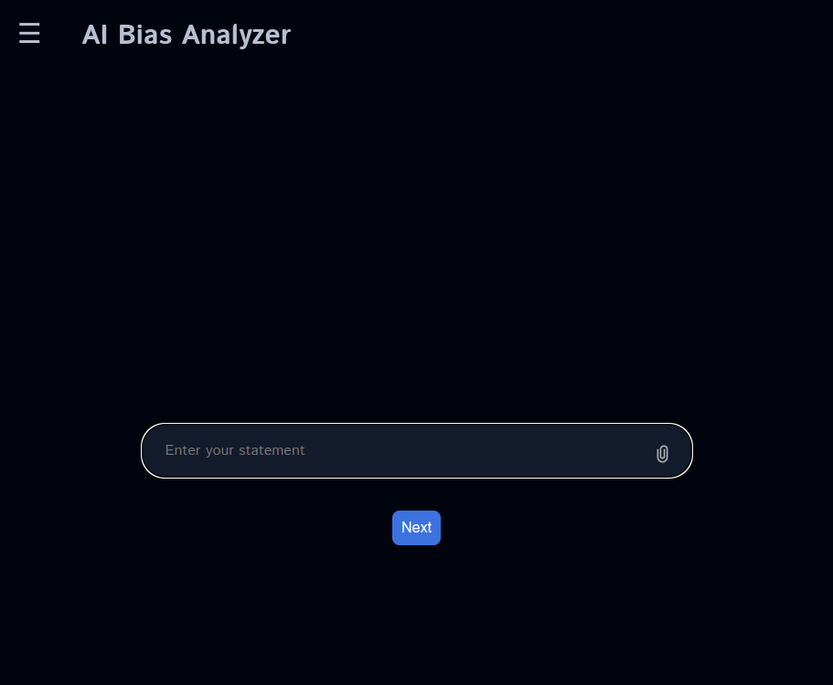
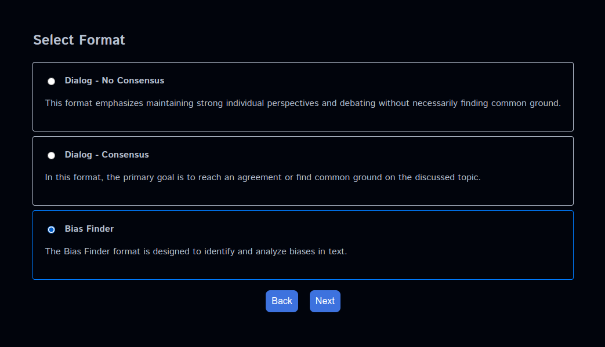
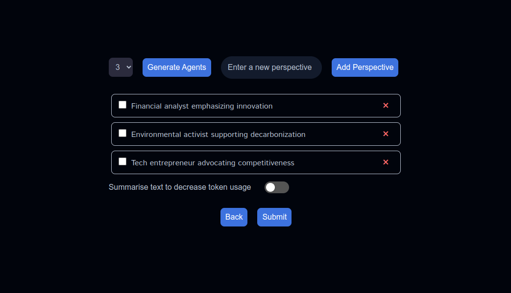
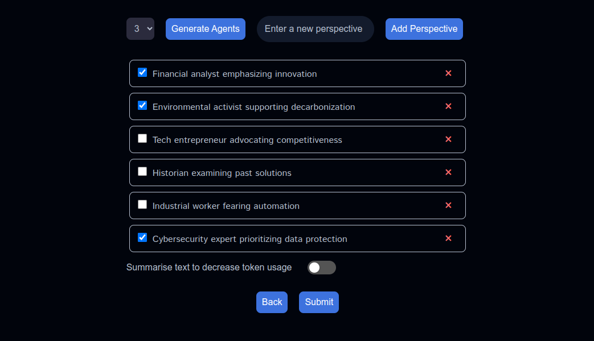
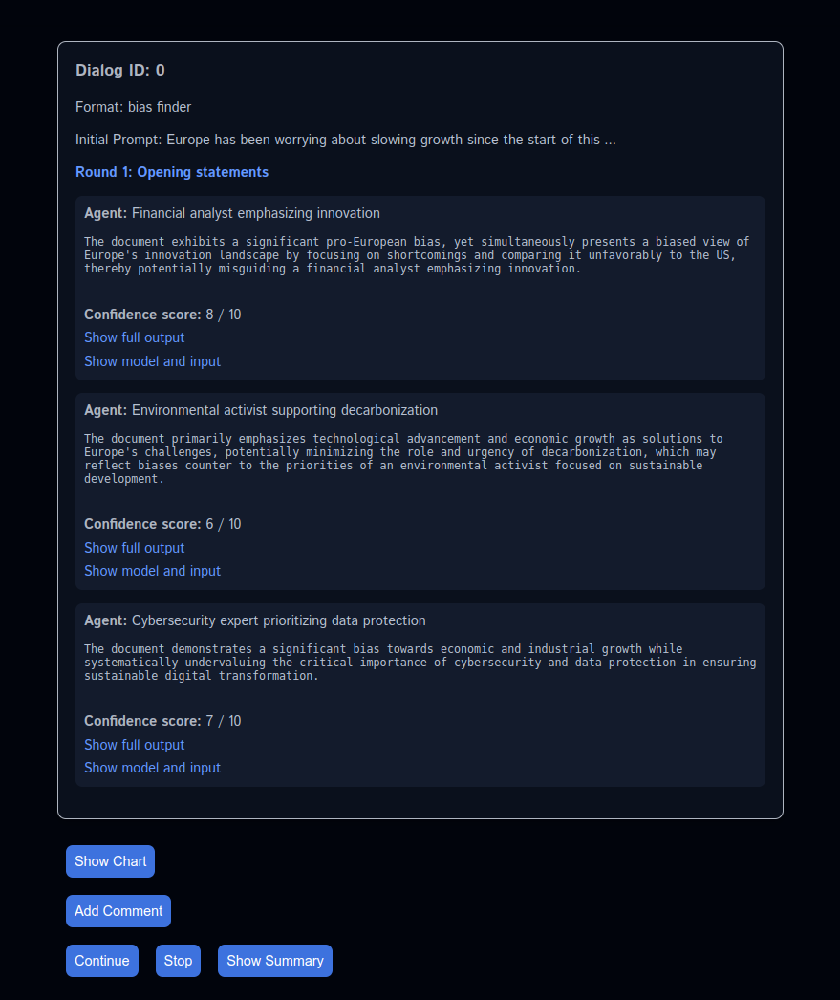
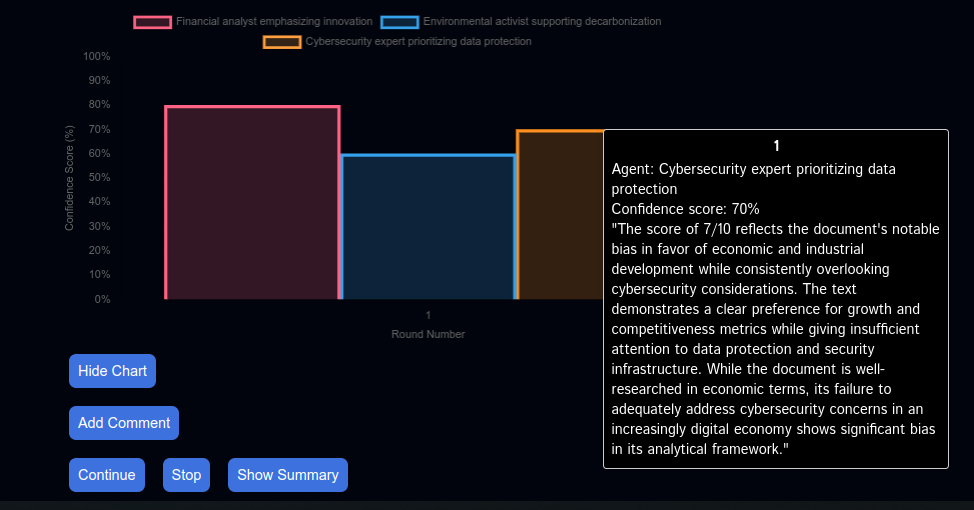
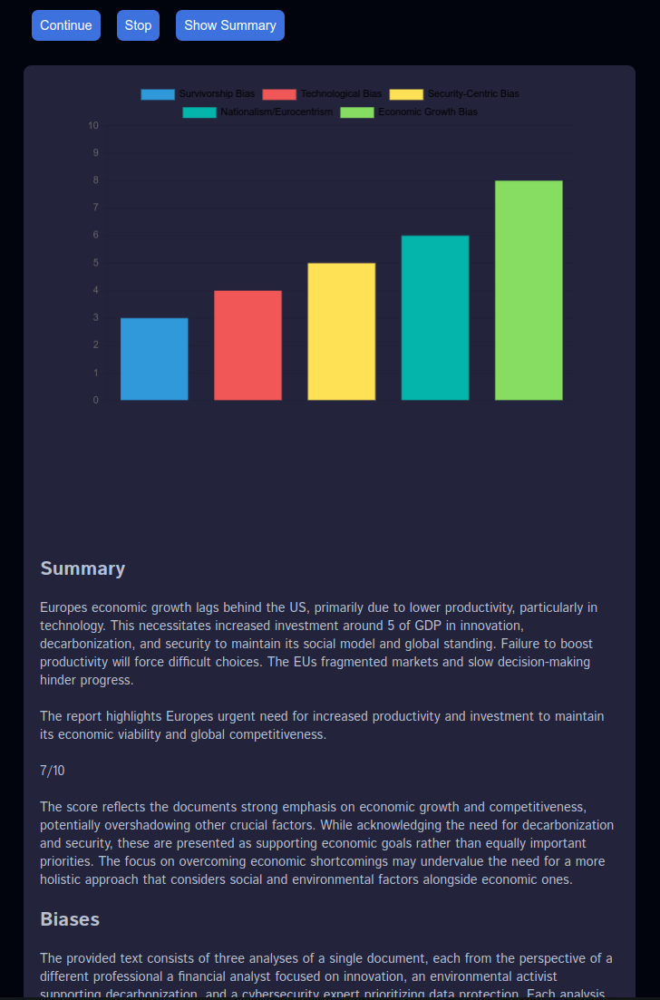

# Sovelluksen käyttöohje

Sovelluksen aloitussivulla voit kirjoittaa kenttään analysoitavan tekstin, tai lisätä tiedoston. Tuetut tiedostomuodot ovat .pdf, .txt, .docx ja .odt. Siirry sen jälkeen seuraavaan vaiheeseen painamalla _Next_-nappia.

Toisessa vaiheessa voit valita käytettävän formaatin.

Kolmannessa vaiheessa saat syöttämäsi tekstin perusteella automaattisesti generoituja ehdotuksia agenteiksi. Voit luoda automaattisesti lisää agentteja painamalla _Generate Agents_-nappia. Voit myös kirjoittaa haluamasi agenttiroolin kenttään ja lisätä sen listalle painamalla _Add Perspective_

Voit valita haluamasi agentit klikkaamalla niitä. Laittamalla päälle ominaisuuden _Summarise text to decrease token usage_ annat sovellukselle luvan käyttää tekstistäsi tai tiedostostasi automaattisesti tiivistettyä versiota, jolloin kielimalleille syötettävät promptit ovat lyhempiä ja vähentävät sovelluksen käyttämiä tokeneita. Painamalla _Submit_-nappia sovellus aloittaa analyysin. Vastausten saaminen kielimalleilta kestää jonkin aikaa. Syötteen pituudesta riippuen lataaminen kestää muutamasta sekunnista minuuttiin.

Dialogi alkaa agenttien aloituspuheenvuoroilla, jotka he antavat näkemättä muita agentteja tai niiden mielipiteitä. Voit jatkaa agenttien keskustelua painamalla _Continue_-nappia, jolloin agentit antavat jatkopuheenvuoron yksi kerrallaan siten, että he näkevät kaikki keskustelun aiemmat kommentit ja voivat muuttaa näkemyksiään niiden perusteella.

Saat näkyviin agenttien _confidence scoreja_ kuvaavan kaavion painamalla _Show Chart_. Viemällä kursorin kaavion päälle näet agentin perustelut antamalleen confidence scorelle.

Näet tiivistelmän käydystä keskustelusta sekä löydetyt biakset painamalla _Show Summary_-nappia. Saat näkyviin lyhyen selityksen biaksesta kun viet kursorin bias-kaavion päälle.

Voit lopettaa dialogin painamalla _Stop_ nappia. Sen jälkeen voit aloittaa uuden keskustelun. Lopettamisen jälkeen et voi jatkaa enää vanhoja keskusteluja, mutta voit lukea niitä yläkulman valikon kautta.

