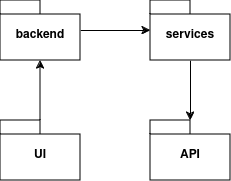
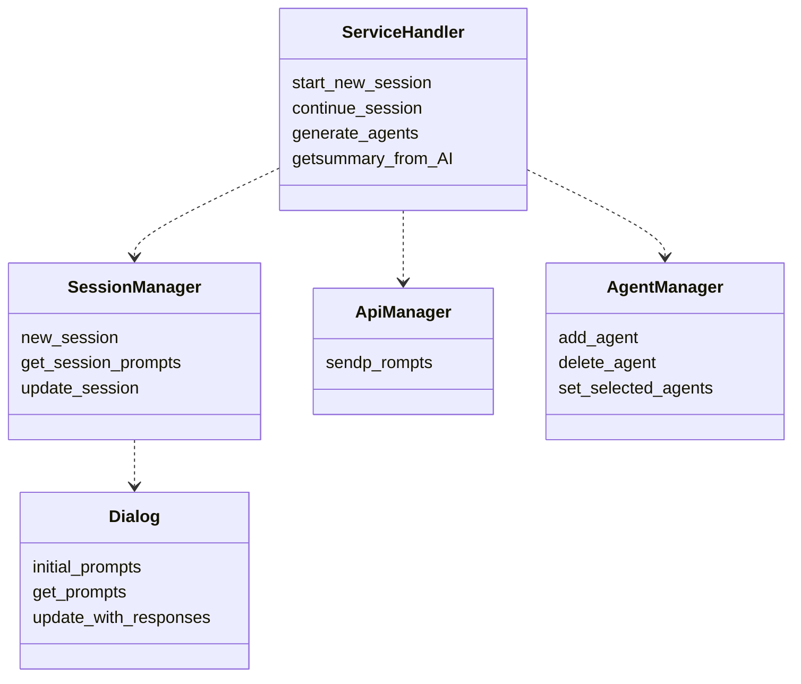
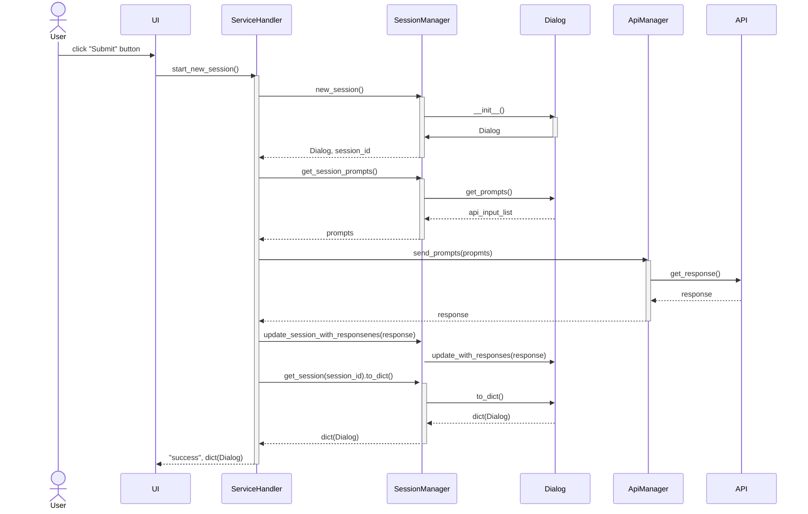

# Arkkitehtuuri

## Rakenne

Sovelluksen rakennetta kuvaa pakkausrakenne:

_UI_ sisältää selainkäyttöliittymän koodin. _Services_ sisältää sovelluslogiikan koodin ja erikseen kutsuu _API_-pakkauksen kielimallikutsuista vastaavia luokkia.

## Sovelluslogiikka

Sovelluslogiikan muodostavat logiikkaluokka Service handler ja session manager -luokka, jotka hoitavat Api manager ja Agent manager -luokkien toimintaa. Dialog luokka hoitaa mm. formatointia valitun formaatin mukaan:

## Päätoiminnallisuudet

### Syötteen ja formaatin valitseminen

Sovelluksen etusivulla voi syöttää tulevaisuusväittämän itse tai lisätä tiedoston (txt, pdf, docx, odt). Seuraavassa vaiheessa _next_-napin painalluksen jälkeen käyttäjä voi valita formaatin. Formaatit ovat _dialog-no-consensus_, _dialog-consensus_ ja _bias-finder_.

### Uuden dialogin aloittaminen

Kun käyttäjä on syöttäny aloitusväittämän tai -tiedoston, etenee sovelluksen toiminta seuraavasti:

### Dialogin jatkaminen

Sovelluksessa voi edellisen kohdan jälkeen jatkaa "keskustelua" painamalla _continue_ -näppäintä. Sovelluksen toiminta jatkuu silloin samalla tavalla, kuin aloituksen dialogin luomisen jälkeen.

### Dialogin lopettaminen

Sovelluksessa voi "keskustelun" lopettaa painamalla _stop_-näppäintä. Tällöin sovellus palaa alkutilaan, josta voi aloittaa uuden dialogin ja valita formaatin.
